# Informe de Análisis de Series Temporales
## Generación Eléctrica Mensual de Argentina (2015-2023)

**Curso:** Análisis de Series de Tiempo (02MIA2026) — Especialización en Inteligencia Artificial, UBA FIUBA
**Docente:** Camilo Argoty
**Alumnos:** Gustavo Rivas, Carlos Rivas, Fermín Rodríguez
**Notebook de referencia:** [`TP_Final_Generacion_Electrica_Argentina_v1.ipynb`](TP_Final_Generacion_Electrica_Argentina_v1.ipynb)

---

## Consigna

Documento con la consigna: [`Modelo_TP_final_AST_MIA_3Co202.pdf`](Modelo_TP_final_AST_MIA_3Co202.pdf)

La consigna pide dos entregables, cada uno con un peso del 50 % de la nota:

### 1) Código en Python comentado y reproducible (50 %)

Debe incluir:

| Requisito de la consigna | Dónde se resuelve en el notebook [`v1`](TP_Final_Generacion_Electrica_Argentina_v1.ipynb) |
|---|---|
| a. Limpieza y preparación de los datos | Secciones 2 y 3 (carga del dataset de Kaggle, filtrado por Argentina, verificación de nulos/outliers/frecuencia) |
| b. Creación de modelos de series de tiempo (mínimo 3 tipos) | Sección 6: se construyeron **4 modelos** — ARIMA, SARIMA, Holt-Winters (aditivo y multiplicativo) y Prophet |
| c. Generación de pronósticos por modelo, evaluación y comparación | Secciones 6.5 y 8: pronósticos sobre el conjunto de prueba (2023) + pronóstico operativo a futuro (2024) con métricas MAE/RMSE/MAPE |

### 2) Informe de análisis (50 %)

Debe incluir los puntos **a) a e)** detallados a continuación. Este documento (`INFORME.md`) desarrolla cada uno de esos puntos, reutilizando los gráficos, tablas y resultados generados por el notebook `v1`:

| Punto de la consigna | Sección de este informe |
|---|---|
| a. Planteamiento de la pregunta de investigación | [1. Pregunta de Investigación](#1-planteamiento-de-la-pregunta-de-investigación) |
| b. Descripción de los datos (origen y tipo de cada atributo) | [2. Descripción de los Datos](#2-descripción-de-los-datos) |
| c. Descripción de los modelos (características + gráficas de la serie original y de los datos simulados) | [3. Descripción de los Modelos](#3-descripción-de-los-modelos) |
| d. Pruebas sobre los modelos (resultados de pruebas, evaluaciones y validaciones) | [4. Pruebas sobre los Modelos](#4-pruebas-sobre-los-modelos) |
| e. Conclusiones (sobre el fenómeno y los modelos, respondiendo la pregunta de investigación, lecciones aprendidas) | [5. Conclusiones](#5-conclusiones) |

---

## 1. Planteamiento de la Pregunta de Investigación

### 1.1 Motivación y marco teórico

La generación eléctrica es un proceso con fuerte componente estacional (determinada por el ciclo climático anual) y, al mismo tiempo, sensible a choques estructurales de mediano plazo (variaciones del nivel de actividad económica, cambios regulatorios, eventos extraordinarios como la pandemia de 2020). Desde el punto de vista del análisis de series de tiempo, esto convierte a la serie de generación eléctrica argentina en un caso de estudio apropiado para contrastar dos grandes familias de modelos:

- **Modelos basados en la metodología Box-Jenkins** (ARIMA/SARIMA), que requieren que la serie sea (o pueda transformarse en) **estacionaria** —es decir, que su media, varianza y estructura de autocorrelación no dependan del tiempo— y que modelan explícitamente la dependencia serial mediante términos autorregresivos (AR) y de medias móviles (MA).
- **Modelos de suavizado exponencial y de descomposición** (Holt-Winters, Prophet), que no exigen estacionariedad previa, sino que estiman directamente componentes interpretables de **nivel, tendencia y estacionalidad**, actualizándolos de forma recursiva (Holt-Winters) o mediante regresión con términos de Fourier (Prophet).

Comparar ambas familias sobre la misma serie permite no solo identificar cuál predice mejor, sino también entender **por qué** lo hace: si el motor de la serie es principalmente la estacionalidad determinística anual, se espera que los modelos que la capturan de forma explícita (SARIMA, Holt-Winters, Prophet) superen ampliamente a un modelo sin componente estacional (ARIMA). Adicionalmente, dado que la serie de tasas de crecimiento mensuales exhibe períodos alternados de mayor y menor variabilidad (*volatility clustering*), se incorpora un modelo **GARCH(1,1)** como extensión para caracterizar la dinámica de la varianza, algo que los modelos de la media (ARIMA/SARIMA/HW/Prophet) no contemplan.

### 1.2 Pregunta de investigación

**Pregunta principal:** ¿Cuál modelo de series de tiempo (ARIMA, SARIMA, Holt-Winters o Prophet) proporciona las predicciones más precisas para la generación eléctrica mensual de Argentina, y qué papel juega la fuerte estacionalidad anual (picos de verano e invierno) en el rendimiento de cada modelo?

**Objetivos específicos:**

1. Identificar y caracterizar los patrones temporales (tendencia y estacionalidad) de la generación eléctrica argentina, distinguiendo si la relación entre el nivel de la serie y la amplitud estacional es de tipo **aditivo** o **multiplicativo**.
2. Evaluar la capacidad predictiva de ARIMA, SARIMA, Holt-Winters (aditivo y multiplicativo) y Prophet, justificando los órdenes de los modelos con pruebas formales de estacionariedad (ADF y KPSS) y validando los residuos de los modelos ajustados (Ljung-Box).
3. Determinar el modelo más adecuado para pronósticos de generación a corto plazo —mediante una validación *out-of-sample* sobre 2023— y emitir un pronóstico operativo para 2024 con sus respectivos intervalos de confianza.

---

## 2. Descripción de los Datos

### 2.1 Origen del dataset

- **Fuente:** [Electricity Production Dataset](https://www.kaggle.com/datasets/sazidthe1/global-electricity-production) (Kaggle, autor *sazidthe1*).
- **Cobertura original:** producción eléctrica mensual de **48 países**, entre 2010 y 2023.
- **Filtros aplicados:** `Country == "Argentina"` y `parameter == "Net Electricity Production"` (para evitar duplicar registros por tipo de combustible/fuente).
- **Cobertura efectiva de la serie de Argentina:** **108 meses, de enero de 2015 a diciembre de 2023** (los meses previos a 2015 no están reportados para el país).

### 2.2 Atributos del dataset original

| Columna | Tipo de dato | Descripción |
|---|---|---|
| `country_name` | texto (categórico) | Nombre del país (se filtra por "Argentina") |
| `date` | fecha (datetime) | Fecha del registro mensual |
| `parameter` | texto (categórico) | Tipo de medición (se usa "Net Electricity Production") |
| `product` | texto (categórico) | Fuente/producto de generación |
| `value` | numérico (float) | Valor de producción eléctrica |
| `unit` | texto (categórico) | Unidad de medida (GWh) |

Tras el filtrado y la agrupación mensual, la serie final utilizada es **univariada**:

| Columna | Tipo de dato | Descripción |
|---|---|---|
| `date` (índice) | datetime, frecuencia mensual (`MS`) | Mes de referencia, de 2015-01 a 2023-12 |
| `GenGWh` | float | Generación eléctrica neta mensual de Argentina, en GWh |

### 2.3 Calidad de los datos

- **Valores faltantes:** 0
- **Meses faltantes en la serie:** ninguno (serie mensual continua y completa)
- **Valores atípicos (método IQR):** 0 detectados
- **Estadísticas descriptivas de `GenGWh`:**

| Estadístico | Valor (GWh) |
|---|---|
| count | 108 |
| mean | 33.811,41 |
| std | 3.058,10 |
| min | 25.655,53 |
| 25% | 31.449,74 |
| 50% (mediana) | 33.508,27 |
| 75% | 35.880,90 |
| max | 40.882,60 |

### 2.4 Visualización inicial de la serie

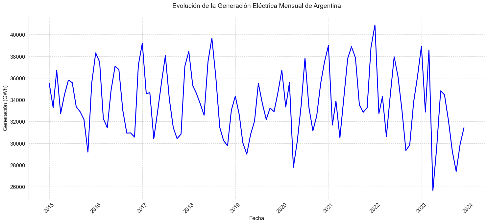

**Observaciones:**

- La serie oscila en torno a un nivel medio de **~33.800 GWh/mes** (~405.000 GWh/año), con una dispersión relativamente moderada (coeficiente de variación ≈ 3.058 / 33.811 ≈ **9 %**), lo cual ya anticipa que las oscilaciones estacionales son la fuente dominante de variabilidad, más que una tendencia de largo plazo.
- Para evaluar la existencia de tendencia se utilizó la **correlación de Spearman** entre el índice temporal y el nivel de la serie (ρ ≈ -0,11; p ≈ 0,26). Se eligió Spearman en lugar de Pearson porque (a) es una medida de **asociación monótona** que no exige una relación lineal ni distribución normal de los datos, y (b) es más robusta frente a los valores extremos puntuales que presenta la serie (por ejemplo, la caída asociada a la pandemia de 2020). El resultado (ρ cercano a 0 y p > 0,05) indica que **no existe evidencia estadística de una tendencia monotónica significativa** a lo largo de los 9 años: el nivel medio de la serie no ha crecido ni decrecido de forma sostenida.
- Sin embargo, esta ausencia de tendencia global **convive con un quiebre estructural reciente**: se observa un **descenso marcado en los últimos años**, de -11,6 % en 2022 y -19,3 % en 2023 (ver tabla de crecimiento anual más abajo). Este tipo de comportamiento —estable en el largo plazo pero con un cambio de régimen al final de la muestra— es justamente el escenario más desafiante para los modelos univariados: toda la información histórica "tira" hacia el nivel promedio, mientras que el conjunto de prueba (2023) refleja un nivel sistemáticamente más bajo. Este quiebre afecta el desempeño de todos los modelos sobre el conjunto de prueba.
- Se distingue una **estacionalidad anual marcada**, coherente con un país del hemisferio sur (picos de generación en verano por aire acondicionado y en invierno por calefacción), lo que sugiere que un componente estacional de período `s=12` será central en los modelos.
- Se identifican caídas puntuales asociables a eventos concretos, como el inicio de la pandemia en 2020, que constituyen *outliers* aditivos puntuales más que cambios permanentes de nivel.

### 2.5 Tasas de crecimiento

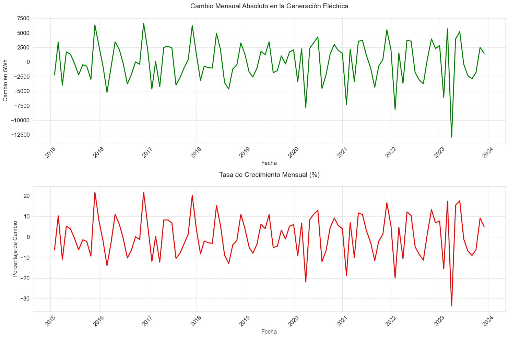

| Año | Crecimiento anual (GWh) | Tasa anual (%) |
|---|---|---|
| 2015 | +23,16 | +0,07 % |
| 2016 | -1.121,35 | -2,93 % |
| 2017 | -2.109,06 | -5,38 % |
| 2018 | -5.403,38 | -14,06 % |
| 2019 | +299,03 | +0,87 % |
| 2020 | +771,11 | +2,10 % |
| 2021 | -179,06 | -0,46 % |
| 2022 | -4.760,54 | **-11,64 %** |
| 2023 | -7.497,55 | **-19,26 %** |

Más allá de las tasas de crecimiento *anuales* (interanuales) presentadas en la tabla, en la sección 4.5 se trabaja además con las **tasas de crecimiento mensuales** (variaciones porcentuales mes a mes) como insumo para el modelo GARCH. Esta serie de variaciones mensuales presenta una media cercana a cero pero con **alternancia de períodos de alta y baja volatilidad** (*volatility clustering*): meses de fuerte ajuste estacional (por ejemplo, las transiciones entre temporada alta y baja) conviven con meses de variación moderada. Esta heterocedasticidad condicional es la motivación directa para incorporar un modelo de la familia ARCH/GARCH, que modela la varianza de los errores como un proceso que evoluciona en el tiempo, en lugar de asumirla constante.

---

## 3. Descripción de los Modelos

### 3.1 Análisis de componentes de la serie (previo a modelar)

#### 3.1.1 Marco teórico: descomposición clásica aditiva vs. multiplicativa

La descomposición clásica de una serie temporal asume que la serie observada $Y_t$ puede expresarse como la combinación de tres componentes no observables: **tendencia** ($T_t$), **estacionalidad** ($S_t$) y **residuo o componente irregular** ($R_t$). Existen dos formas de combinarlos:

- **Modelo aditivo:** $Y_t = T_t + S_t + R_t$. Es adecuado cuando la **amplitud** de las fluctuaciones estacionales se mantiene aproximadamente **constante** a lo largo del tiempo, independientemente del nivel de la serie.
- **Modelo multiplicativo:** $Y_t = T_t \times S_t \times R_t$. Es adecuado cuando la amplitud estacional **crece o decrece proporcionalmente** al nivel de la tendencia (es decir, la estacionalidad es un *porcentaje* del nivel, no una cantidad fija de GWh).

En la práctica, `statsmodels.seasonal_decompose` estima $T_t$ mediante una **media móvil centrada** de orden igual al período estacional (12 meses, para promediar exactamente un ciclo anual y eliminar la estacionalidad de la estimación de tendencia). Luego obtiene la serie "destendenciada" ($Y_t - T_t$ o $Y_t / T_t$, según el esquema) y promedia esos valores por mes calendario para obtener el patrón estacional $S_t$, que se asume **fijo y repetitivo** (mismo valor todos los eneros, todos los febreros, etc.). Finalmente, el residuo $R_t$ es lo que queda sin explicar por tendencia ni estacionalidad, y es el componente que idealmente debería comportarse como **ruido blanco** (sin estructura sistemática remanente).

Antes de seleccionar los modelos, se descompuso la serie en tendencia, estacionalidad y residuos, comparando los esquemas **aditivo** y **multiplicativo**:

| Descomposición aditiva | Descomposición multiplicativa |
|---|---|
| 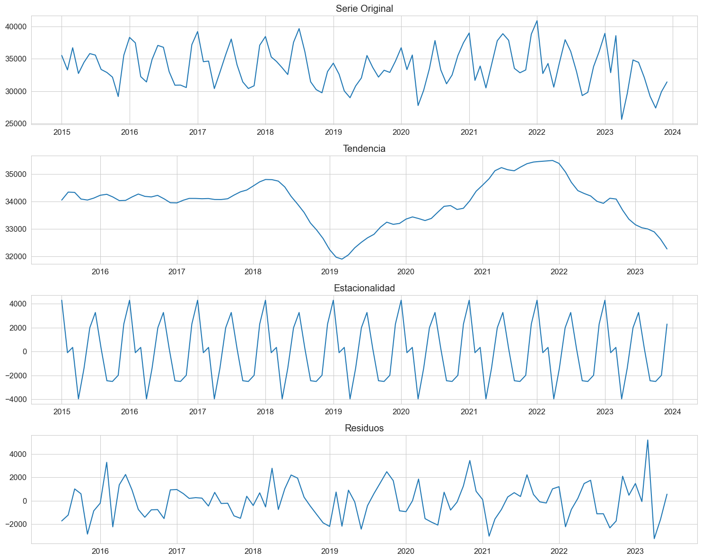 | 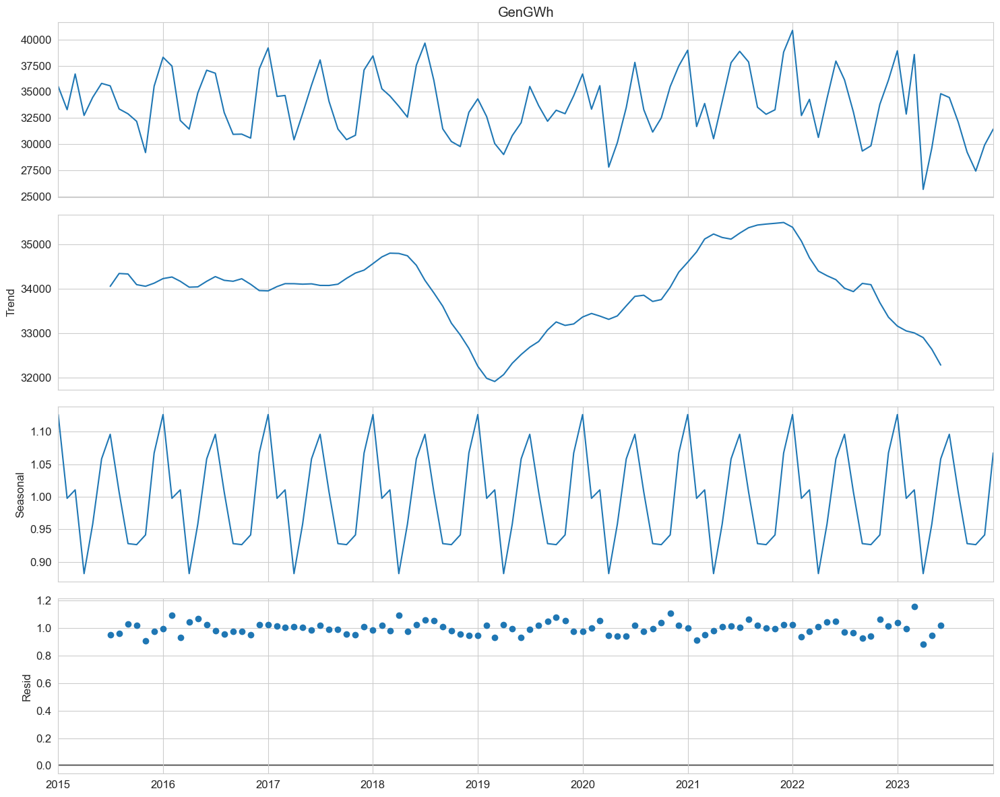 |

- El desvío estándar de los residuos del modelo **aditivo** (≈ 1.548 GWh) resultó marginalmente menor que el equivalente del modelo **multiplicativo** (≈ 1.576 GWh), por lo que ninguno de los dos esquemas puede descartarse de antemano: la diferencia es pequeña y compatible con una estacionalidad cuya amplitud crece muy levemente con el nivel de la serie. Por eso se exploran ambas variantes también en Holt-Winters (sección 3.3) y se deja que la validación *out-of-sample* (sección 4.1) determine cuál captura mejor el comportamiento real.

#### 3.1.2 Patrón estacional

**Patrón estacional bimodal** (medias mensuales con desvío estándar):

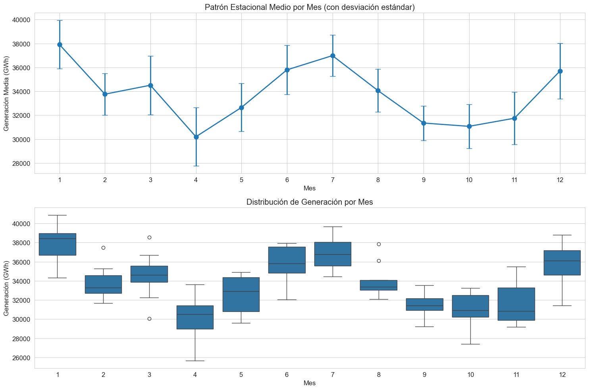

Se confirma un patrón **bimodal**: un pico de **verano** (enero/febrero, por aire acondicionado) y un pico de **invierno** (junio/julio, por calefacción), con valles en los meses de transición (abril-mayo y septiembre-octubre). Este patrón bimodal es la huella característica de la demanda eléctrica en países del hemisferio sur con clima templado/continental, y es precisamente el componente que un modelo **sin** estacionalidad (como ARIMA simple) no puede reproducir, ya que solo dispone de un único término de período (s implícito = 1).

**Tendencia con medias móviles:**

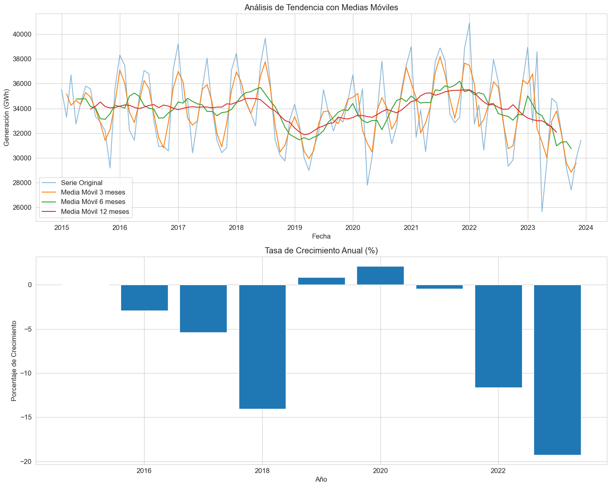

La media móvil de 12 meses suaviza por completo el ciclo estacional y deja ver la evolución del **nivel subyacente** de la serie: relativamente estable entre 2015 y 2021, con la caída sostenida de 2022-2023 ya mencionada.

#### 3.1.3 Diagnóstico de los residuos de la descomposición

**Análisis de residuos de la descomposición:**

| Residuos en el tiempo / distribución / Q-Q / ACF |
|---|
| 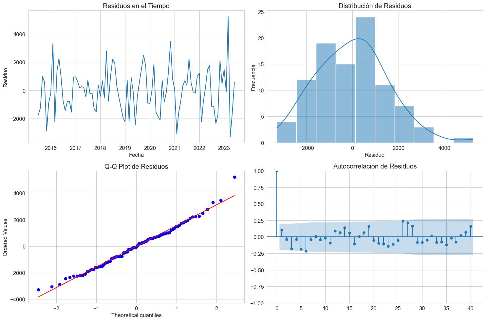 |
| 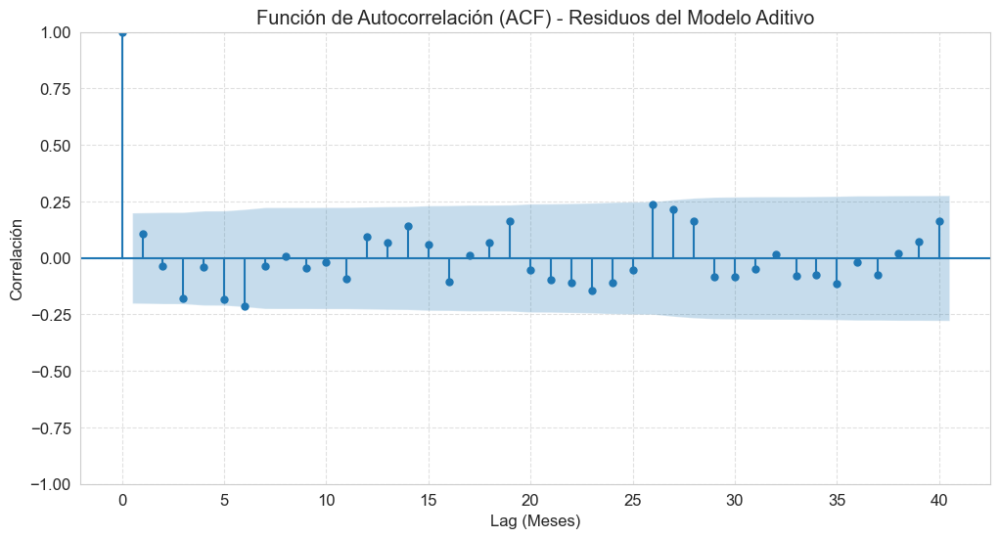 |

Sobre los 96 residuos de la descomposición aditiva (in-sample, 2015-2022) se aplicaron dos chequeos adicionales:

| Prueba | Estadístico | p-valor | Interpretación |
|---|---|---|---|
| Normalidad (D'Agostino-Pearson, $K^2$) | 3,3896 | 0,1836 | No se rechaza H₀ de normalidad (p > 0,05): los residuos son compatibles con una distribución normal |
| ADF sobre los residuos | -5,5307 | 0,0000 | Se rechaza H₀ de raíz unitaria (p < 0,05): **los residuos son estacionarios** |

Estos dos resultados son consistentes con un buen ajuste de la descomposición: si la tendencia y la estacionalidad explican correctamente la dinámica de la serie, lo que queda (el residuo) debería ser un proceso **estacionario y aproximadamente normal**, sin estructura adicional que un modelo más complejo pudiera explotar. La media de los residuos prácticamente nula (-7,63 GWh frente a un nivel medio de ~33.800 GWh) y la ausencia de estructura visible en el gráfico ACF de residuos refuerzan esta lectura.

### 3.2 Pruebas de estacionariedad (justificación de los órdenes `d` y `D`)

#### 3.2.1 Por qué importa la estacionariedad

La metodología Box-Jenkins (en la que se basan ARIMA y SARIMA) requiere trabajar con series **estacionarias en sentido débil**: media constante, varianza constante y autocovarianza que depende solo del rezago (lag) y no del momento del tiempo. Si la serie original no cumple esta condición —por ejemplo, porque tiene una tendencia o un ciclo determinístico— los coeficientes AR/MA estimados no son interpretables ni estables, y los pronósticos de largo plazo pueden divergir. La solución estándar es **diferenciar** la serie: la diferenciación regular de orden `d` ($\nabla^d Y_t = (1-B)^d Y_t$, donde $B$ es el operador de rezago $BY_t = Y_{t-1}$) elimina tendencias polinómicas, mientras que la diferenciación estacional de orden `D` y período `s` ($\nabla_s^D Y_t = (1-B^s)^D Y_t$) elimina patrones que se repiten cada `s` períodos (en este caso, `s=12` por la estacionalidad anual).

#### 3.2.2 ADF y KPSS: dos pruebas complementarias

Se aplicaron dos pruebas de raíz unitaria con **hipótesis nulas opuestas**, de forma que coincidan en su conclusión solo cuando la evidencia es robusta:

- **ADF (Augmented Dickey-Fuller):** contrasta H₀: *la serie tiene una raíz unitaria* (es no estacionaria, sigue un proceso tipo paseo aleatorio) frente a H₁: *la serie es estacionaria*. La prueba se basa en la regresión $\Delta Y_t = \alpha + \beta t + \gamma Y_{t-1} + \sum_{i=1}^{k} \delta_i \Delta Y_{t-i} + \varepsilon_t$, y evalúa si $\gamma = 0$ (raíz unitaria, H₀) o $\gamma < 0$ (reversión a la media, estacionaria). Un **p-valor bajo (< 0,05) permite rechazar H₀** y concluir que la serie es estacionaria.
- **KPSS (Kwiatkowski-Phillips-Schmidt-Shin):** contrasta H₀: *la serie es estacionaria (o estacionaria en torno a una tendencia)* frente a H₁: *la serie tiene una raíz unitaria*. Descompone la serie en una tendencia determinística, un paseo aleatorio y un error estacionario, y evalúa si la varianza del componente de paseo aleatorio es cero (H₀) o positiva (H₁). Aquí un **p-valor alto (> 0,05) implica que no se rechaza H₀** (estacionaria).

Usar ambas pruebas en conjunto —enfoque conocido como **análisis confirmatorio**— reduce el riesgo de concluir erróneamente que una serie es estacionaria basándose en una sola prueba: si ADF rechaza no-estacionariedad **y** KPSS no rechaza estacionariedad, la evidencia es consistente y robusta en ambas direcciones.

#### 3.2.3 Resultados sobre la serie y sus diferencias

Se aplicaron ambas pruebas sobre la serie original y sobre versiones diferenciadas:

| Versión de la serie | ADF stat | ADF p-valor | Conclusión ADF | KPSS stat | KPSS p-valor | Conclusión KPSS |
|---|---|---|---|---|---|---|
| Serie original | -1,555 | 0,5064 | NO estacionaria | 0,136 | 0,100 | Estacionaria |
| 1 diferencia regular (`d=1`) | -4,235 | 0,0006 | **Estacionaria** | 0,032 | 0,100 | Estacionaria |
| 1 diferencia estacional (`D=1`, lag 12) | -2,508 | 0,1134 | NO estacionaria | 0,194 | 0,100 | Estacionaria |
| `d=1` + `D=1` | -4,141 | 0,0008 | **Estacionaria** | 0,106 | 0,100 | Estacionaria |

**Lectura de la tabla:**

- En la **serie original**, ADF no rechaza H₀ (p = 0,5064): hay evidencia de raíz unitaria. KPSS, por su parte, no rechaza estacionariedad (p = 0,100, valor en el límite superior del rango tabulado), lo que en principio parecería contradictorio, pero es un resultado típico cuando la serie tiene un fuerte componente estacional determinístico: KPSS puede no detectar la no-estacionariedad si esta proviene de la estacionalidad y no de una tendencia estocástica. Por eso no alcanza con mirar una sola prueba.
- Con **una diferencia regular (`d=1`)**, ADF rechaza fuertemente H₀ (p = 0,0006) y KPSS confirma estacionariedad (p = 0,100): la diferenciación regular es la que más aporta a estabilizar el **nivel** de la serie.
- Con **una diferencia estacional (`D=1`, lag 12)** únicamente, ADF todavía no rechaza H₀ (p = 0,1134): diferenciar solo a nivel estacional no alcanza para estabilizar la serie en su conjunto, porque persiste la componente de corto plazo no estacionaria.
- Con **`d=1` + `D=1` combinadas**, ADF vuelve a rechazar fuertemente H₀ (p = 0,0008) y KPSS confirma estacionariedad: esta es la combinación que logra un proceso estacionario tanto a nivel general como estacional.

**Conclusión:** la diferenciación regular (`d=1`) es la que más aporta a estabilizar el nivel de la serie, mientras que la diferenciación estacional (`D=1`, lag 12) es necesaria para eliminar el patrón anual recurrente, y la combinación de ambas produce el resultado más consistente entre ADF y KPSS. Esto justifica empíricamente el uso de **`d=1` y `D=1`** en el modelo SARIMA `(1,1,1)(1,1,1,12)`.

### 3.3 Modelos seleccionados

Se seleccionaron **cuatro modelos** (cumpliendo y superando el mínimo de 3 que pide la consigna), en función de la estructura de tendencia + estacionalidad bimodal observada:

| Modelo | Rol | Componente estacional | Órdenes |
|---|---|---|---|
| **ARIMA** | Línea base / "piso" de comparación (sin componente estacional) | No | (1,1,1) |
| **SARIMA** | Modelo estacional principal | Sí (s=12) | (1,1,1)(1,1,1,12) |
| **Holt-Winters (aditivo)** | Suavizado exponencial con estacionalidad aditiva | Sí | tendencia aditiva, estacionalidad aditiva, período 12 |
| **Holt-Winters (multiplicativo)** | Suavizado exponencial con estacionalidad multiplicativa | Sí | tendencia aditiva, estacionalidad multiplicativa, período 12 |
| **Prophet** | Modelo aditivo (Meta), comparativo, estacionalidad por términos de Fourier | Sí (anual) | `yearly_seasonality=True`, sin estacionalidad semanal/diaria (serie mensual) |

**División entrenamiento/prueba:** se dejó el **último año completo (2023, 12 meses)** como conjunto de prueba, y los **96 meses restantes (2015-2022)** como entrenamiento.

#### ARIMA(1,1,1) — modelo base

Un modelo $\text{ARIMA}(p,d,q)$ se especifica mediante la ecuación $\phi(B)(1-B)^d Y_t = \theta(B)\varepsilon_t$, donde $\phi(B) = 1 - \phi_1 B - \dots - \phi_p B^p$ es el polinomio autorregresivo (AR), $\theta(B) = 1 + \theta_1 B + \dots + \theta_q B^q$ es el polinomio de medias móviles (MA), y $\varepsilon_t$ es ruido blanco. Para `ARIMA(1,1,1)`:

$$(1 - \phi_1 B)(1-B) Y_t = (1 + \theta_1 B)\varepsilon_t$$

- `p=1` (**AR**): el valor diferenciado en $t$ depende linealmente de su propio valor en $t-1$ — captura la "inercia" de corto plazo de la serie.
- `d=1` (**I**, integración): una diferenciación regular para manejar la no estacionariedad de nivel detectada en la sección 3.2.
- `q=1` (**MA**): el valor diferenciado en $t$ depende del error (shock) cometido en $t-1$ — captura la corrección de shocks de corto plazo.
- **Hipótesis:** al no tener componente estacional (no existe un polinomio $(P,D,Q)_s$), el modelo solo puede capturar dinámica de corto plazo (un mes de memoria), por lo que se espera que sea el modelo con **peor desempeño** frente a la fuerte estacionalidad bimodal (período 12) de la serie. Funciona como "piso" o cota inferior de comparación: cualquier modelo que incorpore estacionalidad debería superarlo.

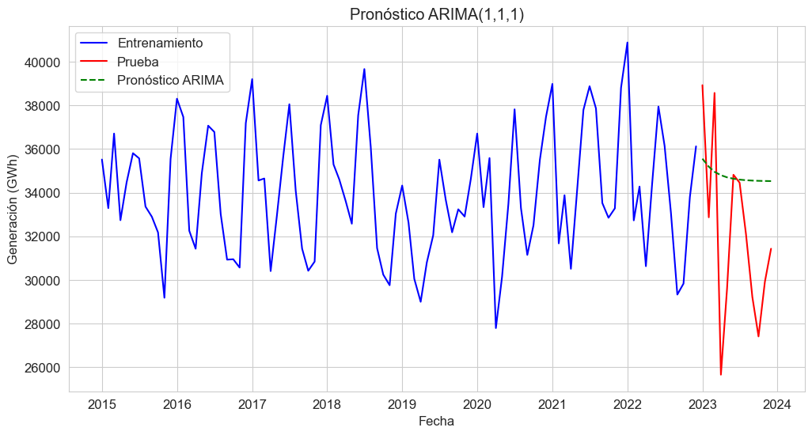

#### SARIMA(1,1,1)(1,1,1,12)

Un modelo $\text{SARIMA}(p,d,q)(P,D,Q)_s$ extiende ARIMA agregando un segundo conjunto de polinomios AR/MA que operan sobre rezagos múltiplos del período estacional `s`:

$$\phi(B)\,\Phi(B^s)\,(1-B)^d (1-B^s)^D Y_t = \theta(B)\,\Theta(B^s)\,\varepsilon_t$$

donde $\Phi(B^s) = 1 - \Phi_1 B^s$ y $\Theta(B^s) = 1 + \Theta_1 B^s$ son los polinomios estacionales AR y MA, respectivamente. Para `SARIMA(1,1,1)(1,1,1,12)`:

- La parte no estacional `(1,1,1)` cumple el mismo rol que en ARIMA: dinámica de corto plazo (mes a mes).
- La parte estacional `(1,1,1,12)` agrega: `D=1` (una diferenciación estacional, $\nabla_{12} Y_t = Y_t - Y_{t-12}$, que compara cada mes con el mismo mes del año anterior), `P=1` (dependencia de $Y_t - Y_{t-12}$ respecto de $Y_{t-12} - Y_{t-24}$) y `Q=1` (corrección por el error estacional del año anterior).
- Estos órdenes `D=1` y `P=1`/`Q=1=12` están directamente justificados por las pruebas ADF/KPSS de la sección 3.2, que mostraron que combinar `d=1` y `D=1` produce la serie más estacionaria.
- **Hipótesis:** al modelar explícitamente el ciclo de 12 meses, se espera que sea uno de los modelos con **mejor desempeño**, ya que ataca directamente la fuente principal de variabilidad de la serie (la estacionalidad bimodal).

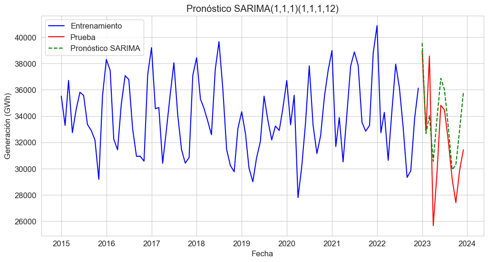

#### Holt-Winters (aditivo y multiplicativo)

El método de **Holt-Winters** (suavizado exponencial triple) modela explícitamente tres componentes —nivel ($\ell_t$), tendencia ($b_t$) y estacionalidad ($s_t$)— mediante ecuaciones recursivas que actualizan cada componente como un promedio ponderado entre la observación más reciente y la estimación previa. En su versión **aditiva**:

$$\ell_t = \alpha (Y_t - s_{t-s}) + (1-\alpha)(\ell_{t-1} + b_{t-1})$$
$$b_t = \beta (\ell_t - \ell_{t-1}) + (1-\beta) b_{t-1}$$
$$s_t = \gamma (Y_t - \ell_t) + (1-\gamma) s_{t-s}$$
$$\hat{Y}_{t+h} = \ell_t + h\,b_t + s_{t+h-s}$$

donde $\alpha, \beta, \gamma \in [0,1]$ son los parámetros de suavizado (estimados por máxima verosimilitud), que regulan cuánto "peso" reciente tiene cada componente frente a su historia. En la versión **multiplicativa**, la estacionalidad y el pronóstico se combinan de forma multiplicativa: $s_t = \gamma (Y_t / \ell_t) + (1-\gamma) s_{t-s}$ y $\hat{Y}_{t+h} = (\ell_t + h\,b_t) \times s_{t+h-s}$.

- Es especialmente efectivo para series con tendencia y estacionalidad bien definidas, ya que sus tres ecuaciones recursivas se ajustan de forma natural a la estructura nivel + tendencia + estación identificada en la descomposición (sección 3.1).
- Se prueba primero la variante **aditiva** y luego la **multiplicativa**, dado que la descomposición sugirió que la amplitud estacional podría crecer levemente con el nivel de la serie (diferencia de residuos de apenas ~30 GWh entre ambos esquemas, sección 3.1.1).

| Holt-Winters aditivo | Holt-Winters multiplicativo |
|---|---|
| 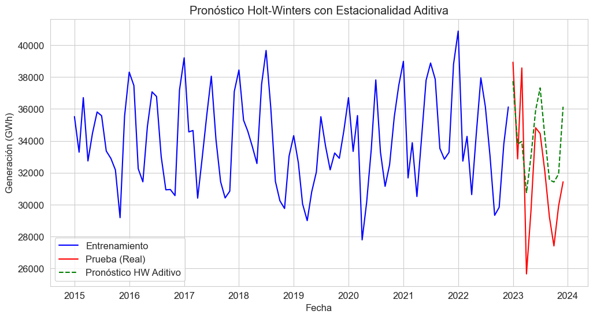 | 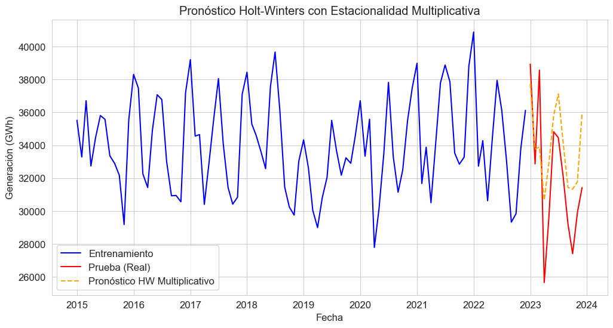 |

#### Prophet

Prophet (desarrollado por Meta) propone un **modelo aditivo descomponible** de la forma:

$$y(t) = g(t) + s(t) + h(t) + \varepsilon_t$$

donde $g(t)$ es la **tendencia** (modelada como una función lineal o logística por tramos, con puntos de cambio detectados automáticamente), $s(t)$ es la **estacionalidad**, aproximada mediante una **serie de Fourier** de orden $N$:

$$s(t) = \sum_{n=1}^{N} \left( a_n \cos\left(\frac{2\pi n t}{P}\right) + b_n \sin\left(\frac{2\pi n t}{P}\right) \right)$$

con período $P=365{,}25$ días para la estacionalidad anual; $h(t)$ representa efectos de feriados/eventos especiales (no utilizado en este trabajo, al tratarse de una serie mensual agregada a nivel país sin calendario de feriados específico); y $\varepsilon_t$ es el término de error.

- A diferencia de ARIMA/SARIMA, Prophet no requiere especificar órdenes `(p,d,q)` ni verificar estacionariedad: ajusta directamente tendencia y estacionalidad mediante un procedimiento de optimización bayesiana (vía Stan), lo que lo hace robusto a datos faltantes y cambios de tendencia, pero también lo vuelve menos sensible a la estructura fina de autocorrelación de corto plazo que sí capturan los términos AR/MA.
- Se incorpora como cuarto modelo comparativo, configurado con `yearly_seasonality=True` y sin estacionalidad semanal/diaria (no aplican a una serie mensual).
- **Hipótesis:** se espera que sea competitivo con SARIMA al capturar la misma estacionalidad anual, pero por una vía no paramétrica (Fourier) en lugar de autorregresiva; su desempeño relativo dependerá de cuánta información útil reside en la dependencia de corto plazo (que Prophet no modela) frente a la estacionalidad pura (que sí modela).

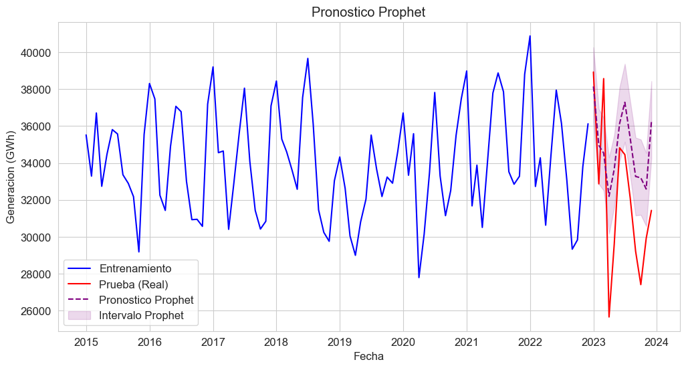

---

## 4. Pruebas sobre los Modelos

### 4.1 Comparación de métricas de error (conjunto de prueba = 2023, 12 meses)

#### 4.1.1 Métricas utilizadas

Para evaluar y comparar los modelos sobre el conjunto de prueba (los 12 meses de 2023, no vistos durante el entrenamiento) se utilizaron tres métricas estándar, cada una con propiedades distintas que las hacen complementarias:

- **MAE (Mean Absolute Error):** $\text{MAE} = \frac{1}{n}\sum_{t=1}^{n} |Y_t - \hat{Y}_t|$. Promedia el error absoluto en las **mismas unidades** que la serie (GWh). Es fácil de interpretar, pero al ser un promedio simple, todos los errores pesan por igual sin penalizar especialmente los errores grandes.
- **RMSE (Root Mean Squared Error):** $\text{RMSE} = \sqrt{\frac{1}{n}\sum_{t=1}^{n} (Y_t - \hat{Y}_t)^2}$. También está en GWh, pero al elevar al cuadrado los errores antes de promediar, **penaliza más fuertemente los errores grandes** (un error de 6.000 GWh contribuye 4 veces más que uno de 3.000 GWh). Que el RMSE sea sistemáticamente mayor que el MAE para todos los modelos indica que existen algunos meses con errores particularmente grandes (consistente con el quiebre de nivel de 2022-2023 mencionado en la sección 2.4).
- **MAPE (Mean Absolute Percentage Error):** $\text{MAPE} = \frac{100\%}{n}\sum_{t=1}^{n} \left|\frac{Y_t - \hat{Y}_t}{Y_t}\right|$. Al ser una medida **relativa** (porcentaje), permite comparar el error entre modelos de forma independiente de la escala de la serie, y es la métrica más intuitiva para comunicar el desempeño ("el modelo se equivoca en promedio un X %"). Su limitación es que se distorsiona cuando $Y_t$ está cerca de cero, lo cual no es un problema aquí dado que la generación eléctrica mensual siempre toma valores grandes (> 25.000 GWh).

Las tres métricas se calculan sobre el **conjunto de prueba (2023)**, es decir, son medidas de error **out-of-sample**: reflejan qué tan bien generaliza cada modelo a datos que no utilizó para estimar sus parámetros, que es la pregunta relevante para un pronóstico operativo.

#### 4.1.2 Resultados

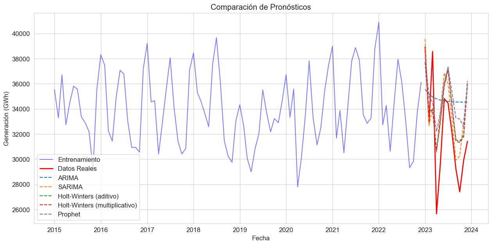

| Modelo | MAE | RMSE | MAPE (%) |
|---|---|---|---|
| **SARIMA (1,1,1)(1,1,1,12)** | 2.507,79 | 2.991,00 | **8,15 %** |
| **Holt-Winters (multiplicativo)** | 2.779,49 | 3.123,55 | **9,02 %** |
| **Holt-Winters (aditivo)** | 2.872,08 | 3.203,34 | **9,32 %** |
| **Prophet** | 3.517,25 | 3.881,71 | **11,61 %** |
| **ARIMA (1,1,1)** | 3.877,02 | 4.617,09 | **13,01 %** |

*(Tabla ordenada de menor a mayor MAPE — corresponde a la ejecución de referencia del notebook `v1`; puede variar levemente entre corridas por la optimización de máxima verosimilitud.)*

El ranking es consistente entre las tres métricas (MAE, RMSE y MAPE producen el mismo orden), lo que da robustez a la conclusión: **SARIMA domina** en las tres dimensiones de error, seguido por los Holt-Winters, luego Prophet, y por último ARIMA sin componente estacional. La brecha entre SARIMA (8,15 %) y ARIMA (13,01 %) —casi 5 puntos porcentuales de MAPE— cuantifica directamente el **valor agregado de modelar la estacionalidad de período 12** sobre esta serie.

### 4.2 Visualización del mejor modelo (SARIMA) vs. datos reales

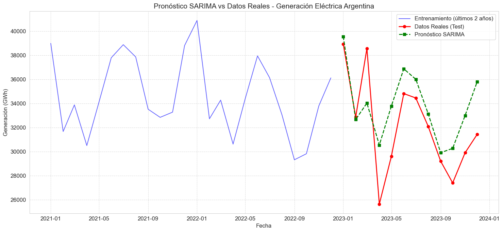

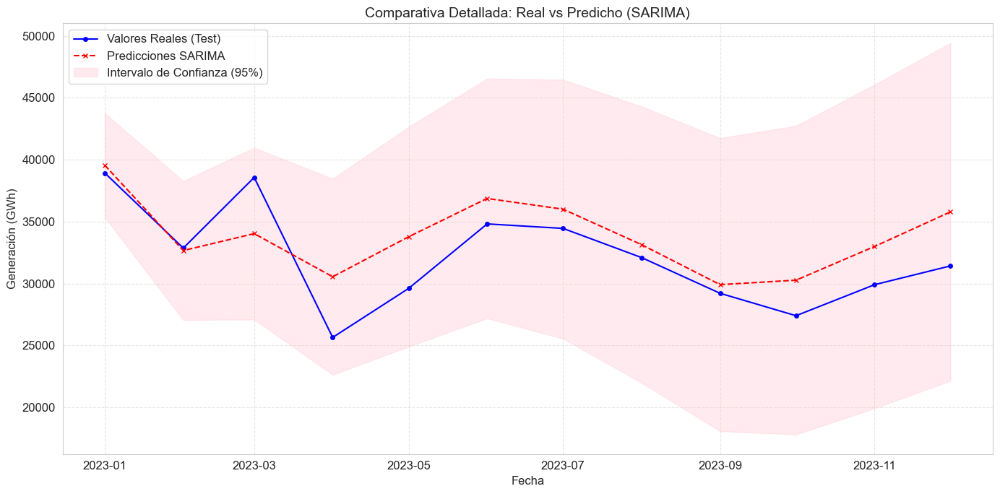

### 4.3 Diagnóstico de residuos del modelo SARIMA

#### 4.3.1 Por qué diagnosticar los residuos

Que un modelo tenga el menor MAPE no garantiza que esté **bien especificado**: es posible que un modelo "gane" por casualidad sobre un conjunto de prueba pequeño (12 meses) mientras deja estructura sin explotar en sus residuos. El diagnóstico de residuos responde a la pregunta complementaria: *¿el modelo agotó toda la información predecible de la serie, o todavía queda autocorrelación que un modelo mejor podría aprovechar?* Si los residuos de un modelo ARIMA/SARIMA correctamente especificado son ruido blanco (sin autocorrelación, media cero, varianza constante), entonces no existe ninguna combinación lineal de valores pasados que permita mejorar el pronóstico.

**ACF y PACF de los residuos:**

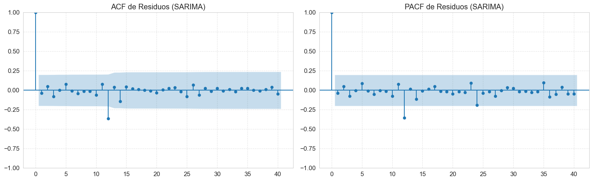

La **función de autocorrelación (ACF)** mide la correlación entre los residuos $e_t$ y sus rezagos $e_{t-k}$ para distintos $k$; la **función de autocorrelación parcial (PACF)** mide esa misma correlación pero "limpiando" el efecto de los rezagos intermedios. Para residuos de ruido blanco, se espera que prácticamente todos los *spikes* de ACF y PACF caigan dentro de la banda de confianza (≈ ±1,96/√n), sin patrones sistemáticos en los rezagos estacionales (12, 24, ...). El gráfico no muestra spikes significativos relevantes, lo cual es consistente con una buena especificación del modelo.

#### 4.3.2 Test de Ljung-Box

El **test de Ljung-Box** formaliza esta inspección visual mediante un estadístico que agrega la autocorrelación de los residuos hasta un rezago máximo $h$:

$$Q(h) = n(n+2)\sum_{k=1}^{h} \frac{\hat{\rho}_k^2}{n-k}$$

donde $n$ es el número de observaciones y $\hat{\rho}_k$ es la autocorrelación muestral de los residuos en el rezago $k$. Bajo H₀ (los residuos son ruido blanco, es decir $\rho_k = 0$ para todo $k \le h$), el estadístico $Q(h)$ se distribuye aproximadamente como una **chi-cuadrado** con $(h - p - q)$ grados de libertad, donde $p$ y $q$ son los órdenes AR y MA del modelo. La regla de decisión es: si **p-valor > 0,05, no se rechaza H₀** (los residuos son consistentes con ruido blanco); si p-valor < 0,05, hay evidencia de autocorrelación residual y el modelo está mal especificado.

| Lag | Estadístico LB | p-valor |
|---|---|---|
| 6 | 1,684 | 0,946 |
| 12 | 17,706 | 0,125 |
| 18 | 20,554 | 0,302 |
| 24 | 20,989 | 0,639 |

**Resultado:** todos los p-valores son > 0,05, incluso en los rezagos estacionales (12 y 24), por lo que **no se rechaza la hipótesis de ruido blanco** en ninguno de los horizontes evaluados: el modelo SARIMA capturó adecuadamente tanto la dinámica de corto plazo como el ciclo anual de la serie, y no quedan patrones sistemáticos explotables en sus residuos. Esto da sustento adicional —más allá del MAPE— a la elección de SARIMA como modelo final.

### 4.4 Extensión 1 — Selección automática de órdenes SARIMA (grid search por AIC)

#### 4.4.1 El criterio de información de Akaike (AIC)

El **AIC** es un criterio de selección de modelos que balancea **bondad de ajuste** y **complejidad**:

$$\text{AIC} = 2k - 2\ln(\hat{L})$$

donde $k$ es el número de parámetros estimados por el modelo y $\hat{L}$ es el valor máximo de la función de verosimilitud (qué tan probable es haber observado los datos dados los parámetros estimados). El término $-2\ln(\hat{L})$ disminuye a medida que el modelo se ajusta mejor a los datos de entrenamiento, mientras que el término $2k$ **penaliza** a los modelos con más parámetros, evitando el sobreajuste (*overfitting*). Entre dos modelos, se prefiere el de **menor AIC**.

Es importante notar que el AIC es una medida **in-sample**: se calcula a partir del ajuste del modelo sobre los datos de entrenamiento, sin usar el conjunto de prueba. Por lo tanto, el AIC sirve para comparar modelos *durante la fase de identificación*, pero no reemplaza a la validación *out-of-sample* (sección 4.1) para evaluar la capacidad predictiva real.

#### 4.4.2 Búsqueda y resultados

Se realizó una búsqueda sistemática sobre combinaciones de `(p,d,q)` y `(P,D,Q,12)`, eligiendo la de menor AIC (equivalente a lo que hace `pmdarima.auto_arima`, mostrando aquí el procedimiento de forma transparente):

| Configuración SARIMA | AIC |
|---|---|
| **(1,1,1)(0,1,1,12)** ← mejor por AIC | 1244,08 |
| (1,1,1)(1,1,1,12) ← elegido manualmente | 1245,97 |
| (0,1,1)(0,1,1,12) | 1248,39 |
| (0,1,1)(1,1,1,12) | 1250,38 |
| (1,0,1)(0,1,1,12) | 1261,68 |

| | MAE | RMSE | MAPE |
|---|---|---|---|
| Mejor-AIC `(1,1,1)(0,1,1,12)` | 2.923,98 | 3.314,50 | 9,47 % |
| Manual `(1,1,1)(1,1,1,12)` | 2.507,78 | 2.990,99 | **8,15 %** |

**Conclusión:** la diferencia de AIC entre ambas configuraciones es de apenas 1,89 puntos (1244,08 vs. 1245,97) — una diferencia **marginal** que indica que ambos modelos tienen un ajuste in-sample prácticamente equivalente. Sin embargo, el modelo de menor AIC `(1,1,1)(0,1,1,12)` (que omite el término AR estacional `P=1`) **no** resultó ser el mejor en el conjunto de prueba (*out-of-sample*): su MAPE (9,47 %) es notablemente peor que el del modelo manual (8,15 %). Esto ilustra de forma concreta el principio de la sección anterior: un criterio in-sample (AIC) y un criterio out-of-sample (MAPE) pueden dar recomendaciones distintas, y para un objetivo de **pronóstico** debe priorizarse la validación out-of-sample. Por eso se mantiene el SARIMA `(1,1,1)(1,1,1,12)` elegido manualmente como modelo final.

### 4.5 Extensión 2 — Modelo de volatilidad GARCH(1,1)

#### 4.5.1 Motivación: heterocedasticidad condicional

Los modelos ARIMA/SARIMA/Holt-Winters/Prophet modelan la **media condicional** de la serie ($E[Y_t \mid \text{información pasada}]$), asumiendo implícitamente que la varianza de los errores es constante (homocedasticidad). Sin embargo, como se mencionó en la sección 2.5, la serie de tasas de crecimiento mensuales presenta **clustering de volatilidad**: a períodos de variación moderada les siguen otros períodos de variación moderada, y a períodos de alta variación les siguen otros de alta variación. Esto es **heterocedasticidad condicional**: la varianza de $\varepsilon_t$ no es constante, sino que depende de información pasada.

#### 4.5.2 El modelo GARCH(1,1)

El modelo **GARCH(1,1)** (Generalized Autoregressive Conditional Heteroskedasticity) modela la varianza condicional $\sigma_t^2$ del error como una función de su propio pasado y del cuadrado de los errores pasados:

$$r_t = \mu + \varepsilon_t, \qquad \varepsilon_t = \sigma_t z_t, \qquad \sigma_t^2 = \omega + \alpha_1 \varepsilon_{t-1}^2 + \beta_1 \sigma_{t-1}^2$$

donde $r_t$ es la tasa de crecimiento mensual, $\mu$ su media (modelo de "media constante"), $z_t$ es ruido blanco con distribución t de Student (elegida por sus colas más pesadas que la normal, apropiadas para capturar la mayor probabilidad de variaciones extremas observada en series económicas), y:

- $\omega > 0$ es la varianza de largo plazo ("piso" de volatilidad),
- $\alpha_1 \ge 0$ (término **ARCH**) mide cuánto reacciona la varianza de hoy ante el cuadrado del shock de ayer (efecto de **shocks recientes**),
- $\beta_1 \ge 0$ (término **GARCH**) mide cuánto "recuerda" la varianza de hoy a la varianza de ayer (**persistencia**).

La suma $\alpha_1 + \beta_1$ determina la **persistencia total** de los shocks de volatilidad: si $\alpha_1+\beta_1 < 1$, el proceso de varianza es estacionario (la volatilidad eventualmente vuelve a su nivel de largo plazo $\omega/(1-\alpha_1-\beta_1)$ tras un shock); cuanto más cerca de 1, más lento es ese retorno.

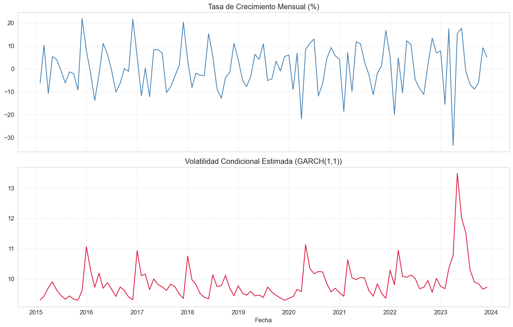

| Parámetro | Coeficiente | p-valor | Interpretación |
|---|---|---|---|
| ω (omega) | 48,053 | 0,010 | Significativo |
| α₁ (ARCH) | 0,073 | 0,473 | No significativo |
| β₁ (GARCH) | 0,436 | 0,030 | Significativo — persistencia de volatilidad |
| ν (grados de libertad t) | 88,92 | 0,781 | No significativo |

#### 4.5.3 Interpretación

- **β₁ ≈ 0,436 (significativo, p = 0,030):** existe **persistencia de la volatilidad** — un mes de alta variabilidad tiende a ser seguido por otro mes también más volátil que el promedio, aunque con $\alpha_1+\beta_1 \approx 0{,}51 < 1$ el proceso de varianza es estacionario y la volatilidad converge relativamente rápido a su nivel de largo plazo (la "vida media" de un shock de volatilidad es corta).
- **α₁ ≈ 0,073 (no significativo, p = 0,473):** el efecto de un shock puntual reciente sobre la volatilidad del mes siguiente es **débil y no distinguible de cero** estadísticamente — la mayor parte de la persistencia proviene del término β (memoria de la varianza), no de reacciones bruscas a sorpresas individuales.
- **ν ≈ 88,9 (no significativo, p = 0,781):** un grado de libertad tan alto para la t de Student la acerca mucho a una distribución normal, sugiriendo que, una vez controlada la heterocedasticidad condicional, los residuos estandarizados no presentan colas extremadamente pesadas.

**Conclusión:** el GARCH(1,1) no busca mejorar el pronóstico puntual (la media) de SARIMA, sino **complementarlo** aportando una estimación dinámica de la incertidumbre: en los meses identificados como de mayor volatilidad condicional, los intervalos de confianza del pronóstico deberían ensancharse, y en los de baja volatilidad, achicarse — algo que un intervalo de confianza de ancho constante (como el que provee SARIMA por defecto) no refleja.

### 4.6 Pronóstico operativo a futuro (2024)

Se reentrenó el modelo SARIMA ganador sobre **toda la serie disponible (2015-2023)** y se proyectaron los **12 meses de 2024**, con su intervalo de confianza del 95 %:

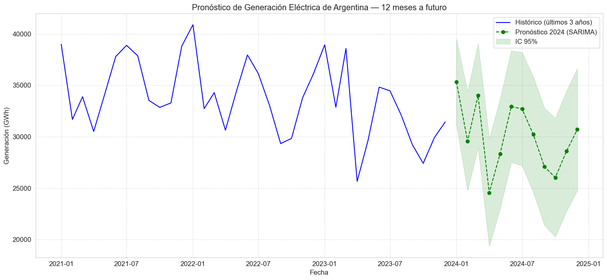

| Mes 2024 | Pronóstico (GWh) | IC inferior 95% | IC superior 95% |
|---|---|---|---|
| Enero | 35.332,0 | 31.161,3 | 39.502,7 |
| Febrero | 29.569,7 | 24.766,7 | 34.372,7 |
| Marzo | 33.996,8 | 28.936,8 | 39.056,9 |
| Abril | 24.556,7 | 19.346,0 | 29.767,4 |
| Mayo | 28.336,8 | 23.013,4 | 33.660,2 |
| Junio | 32.932,5 | 27.511,9 | 38.353,1 |
| Julio | 32.692,5 | 27.181,9 | 38.203,0 |
| Agosto | 30.219,4 | 24.622,6 | 35.816,2 |
| Septiembre | 27.073,2 | 21.392,5 | 32.753,8 |
| Octubre | 26.035,5 | 20.272,6 | 31.798,4 |
| Noviembre | 28.586,3 | 22.742,5 | 34.430,2 |
| Diciembre | 30.695,5 | 24.772,0 | 36.619,1 |

El pronóstico reproduce el patrón bimodal característico verano/invierno (picos en enero y junio-julio).

---

## 5. Conclusiones

1. **Respuesta a la pregunta de investigación:** el modelo **SARIMA(1,1,1)(1,1,1,12)** resultó el más preciso (**MAPE 8,15 %**), confirmando la hipótesis central del trabajo: **la estacionalidad anual es el factor determinante** del pronóstico de generación eléctrica argentina. Incorporar el componente estacional redujo el error de un 13,01 % (ARIMA, sin estacionalidad) a un 8,15 % (SARIMA).

2. **Ranking de modelos:** los **Holt-Winters** se ubicaron en un nivel intermedio (~9 %), por encima de SARIMA pero muy por delante del ARIMA simple, que —al no modelar el ciclo de 12 meses— genera un pronóstico casi plano que ignora la naturaleza bimodal de la demanda argentina. **Prophet** (MAPE 11,61 %) también superó a ARIMA al capturar la estacionalidad anual mediante términos de Fourier, pero no alcanzó a SARIMA ni a Holt-Winters; esto es esperable dado el tamaño reducido de la muestra (108 observaciones) y la ausencia de variables como temperatura o feriados que potencien a Prophet.

3. **Aditivo vs. multiplicativo:** la variante **multiplicativa** de Holt-Winters superó levemente a la aditiva (9,02 % vs. 9,32 %), consistente con una dependencia muy moderada entre el nivel de la serie y la amplitud de su estacionalidad (en la descomposición, sin embargo, el esquema aditivo había sido marginalmente mejor — la diferencia entre ambos enfoques es pequeña).

4. **Limitación principal:** la fuerte contracción de 2022-2023 introduce un quiebre de nivel que ningún modelo lineal anticipa por completo; esto explica buena parte del error residual sobre el conjunto de prueba (2023) y sugiere, como trabajo futuro, incorporar **variables exógenas** (actividad económica, temperatura) vía SARIMAX.

5. **Selección automática vs. manual:** la búsqueda por AIC seleccionó `SARIMA(1,1,1)(0,1,1,12)` (AIC 1244,08), levemente por debajo del modelo manual (AIC 1245,97). Sin embargo, en el conjunto de prueba el modelo manual predijo mejor (MAPE 8,15 % vs. 9,47 %): un buen recordatorio de que el menor AIC (mejor ajuste *in-sample*) no garantiza mejor capacidad predictiva *out-of-sample*.

6. **Volatilidad (GARCH):** se detectó persistencia de la volatilidad (β ≈ 0,44, significativo) pero un efecto débil de shocks recientes (α ≈ 0,07, no significativo), lo que permite construir intervalos de incertidumbre más realistas sin alterar el pronóstico puntual de SARIMA.

7. **Lecciones aprendidas / dificultades:**
   - El dataset de Kaggle es **multi-país y multi-producto**, por lo que fue necesario un filtrado cuidadoso (`Country == "Argentina"` y `parameter == "Net Electricity Production"`) para evitar duplicar valores y obtener una serie mensual univariada y continua.
   - La elección entre descomposición **aditiva y multiplicativa** no era evidente a priori; se resolvió comparando cuantitativamente la dispersión de los residuos de ambas, y se confirmó luego con la comparación out-of-sample de Holt-Winters aditivo vs. multiplicativo.
   - Los órdenes de diferenciación de SARIMA no se fijaron "a ojo": se justificaron formalmente combinando **dos pruebas de hipótesis con conclusiones opuestas (ADF y KPSS)**, lo que obligó a interpretar resultados que en la serie original parecían contradictorios entre sí (sección 3.2.3).
   - El **menor AIC no implica mejor pronóstico out-of-sample**, lo que refuerza la importancia de validar siempre sobre el conjunto de prueba y no solo con criterios de ajuste in-sample — un mismo par de modelos puede ordenarse de forma distinta según el criterio (in-sample vs. out-of-sample) que se use.
   - El diagnóstico de residuos (ACF/PACF + Ljung-Box) demostró ser una herramienta complementaria a las métricas de error: confirmó que el modelo ganador no solo tenía el menor MAPE, sino que además estaba **correctamente especificado** (residuos sin autocorrelación significativa).
   - La fuerte caída de la generación en 2022-2023 es la principal fuente de error de todos los modelos sobre el conjunto de prueba, y es un fenómeno que ningún modelo univariado puede anticipar sin información exógena.

8. **Reflexión metodológica general:** el trabajo siguió, en esencia, el ciclo de la metodología **Box-Jenkins** (identificación → estimación → diagnóstico → pronóstico), enriquecido con dos extensiones que no forman parte del ciclo clásico pero aportan valor práctico: una búsqueda automática de órdenes vía AIC (sección 4.4) y un modelo de la varianza condicional vía GARCH (sección 4.5). La principal lección transversal es que **ningún criterio aislado (AIC, MAPE, p-valores de Ljung-Box) es suficiente por sí solo**: la elección final de un modelo de pronóstico debe combinar (a) fundamentos teóricos sobre la naturaleza de la serie (estacionalidad, estacionariedad), (b) validación empírica out-of-sample, y (c) diagnóstico de que no quede estructura sin explotar en los residuos. SARIMA(1,1,1)(1,1,1,12) fue el único modelo que satisfizo simultáneamente los tres criterios.
